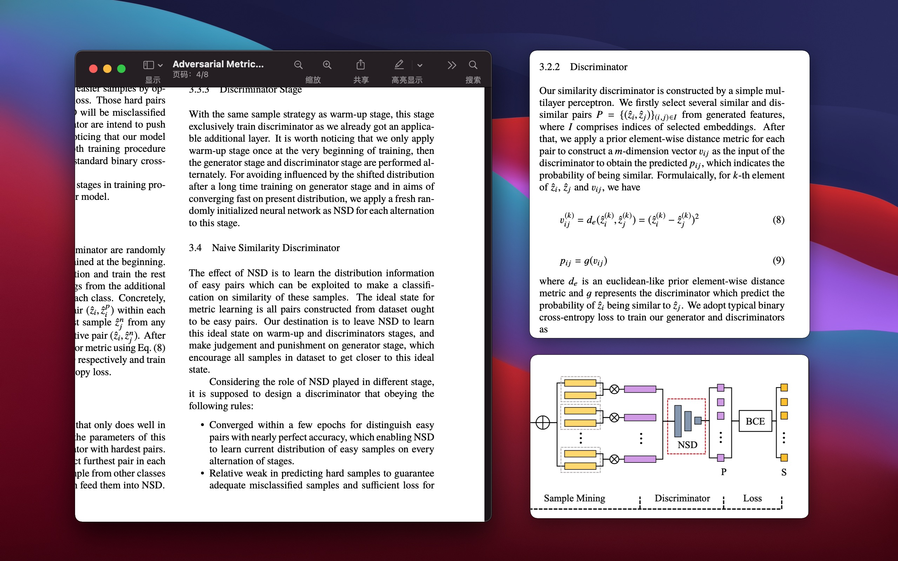

# Introduction

A simple tool to capture and pin regions of screen for macOS.

Preserving important things on your desktop.

My development blog can be found [here](https://www.notion.so/hagemon/Clipin-Mac-OS-38d9044334b04882a81561b949b304e6) (Chinese version) with Notion.

# Usage and feature

- Start with default hot key `cmd+shift+A`.
- Select region with click and drag.
- Move region by clicking inside it and drag.
- Adjust region by clicking dots around and drag.
- Press Enter to pin the region after selection.
- Multiple screen supported.

# Acknowledge

- Highly inspired by [Snip](https://github.com/isee15/Capture-Screen-For-Multi-Screens-On-Mac).
- Intergrate [HotKey](https://github.com/soffes/HotKey) with Swift Package Manager

# TODO

- Support automatically window selection.
- Add basic tools for editing pinned view.